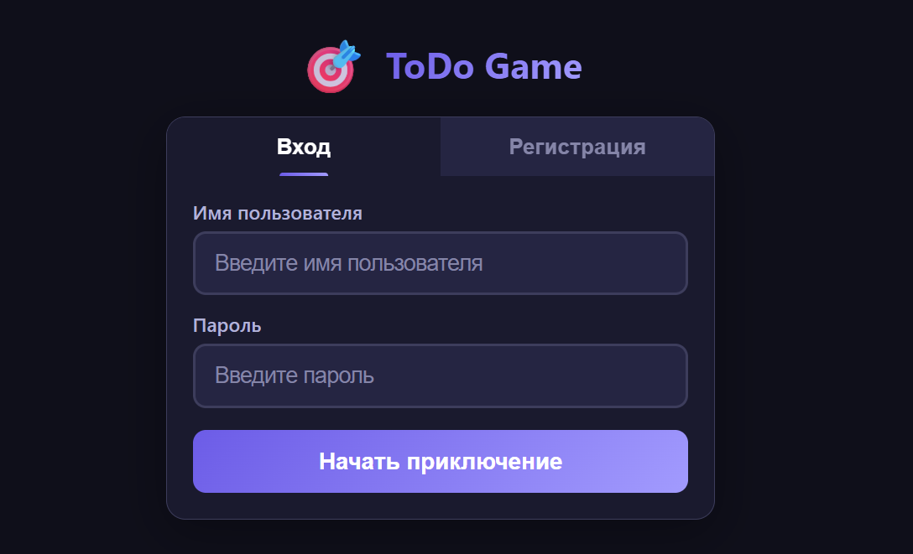
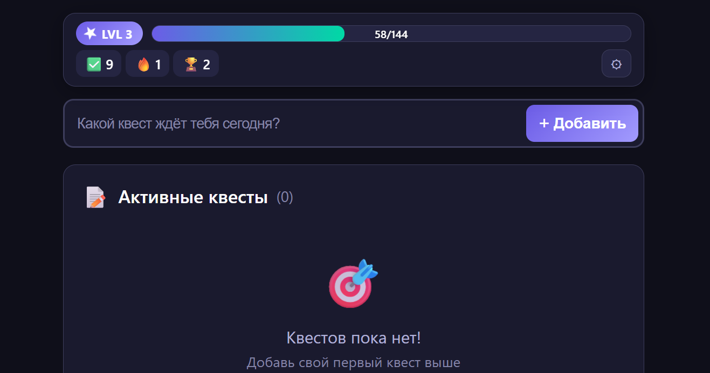

<div align="center">

# 🎮 TODO GAME

## **Твои задачи. Твоя игра. Твоя победа.**

<br>

[](https://python.org)
[](https://flask.palletsprojects.com)
[](https://sqlite.org)
[](LICENSE)

---

</div>

## 🚀 Live Website
> https://todo.weforks.org/

<div align="center">
  
  
</div>

<br>

## 🎯 Что это?

**TODO GAME** — это не очередной скучный список дел.

Это полноценная **RPG-система**, встроенная в твой ежедневный workflow. Каждая задача — это монстр, которого нужно победить. Каждая галочка — это **+XP** к твоему персонажу.

```
   ╔══════════════════════════════════════════╗
   ║  ПРОКАЧАЙ СВОЮ ЖИЗНЬ                     ║
   ║  ████████████████░░░░░░  78%  УР. 12    ║
   ║  🔥 КОМБО x7   ⚡ +245 XP   📅 СЕРИЯ 14  ║
   ╚══════════════════════════════════════════╝
```

## 🔥 Почему это вызывает привыкание

<table>
<tr>
<td width="50%">

### ⚔️ БОЕВАЯ СИСТЕМА

Выполняешь задачу → получаешь **20-35 XP**

Но это только начало...

**COMBO SYSTEM:**
- Выполнил задачу? Таймер пошёл!
- **5 секунд** на следующую
- Combo x2 → x3 → x4 → **x10!**
- Каждый combo = **+10% к XP**

*Одна удачная серия = больше опыта, чем за весь день*

</td>
<td width="50%">

### 📈 ПРОГРЕССИЯ

```
LVL 1   ░░░░░░░░░░  Новичок
LVL 10  ████░░░░░░  Воин рутины
LVL 25  ███████░░░  Мастер дел
LVL 50  ██████████  ЛЕГЕНДА
```

Экспоненциальная кривая:
- Первые уровни летят быстро
- Высокие — требуют dedication
- Чувство прогресса **каждый день**

</td>
</tr>
</table>

---

## 🏆 12 ДОСТИЖЕНИЙ

Охоться за ними всеми:

| Достижение | Условие | Редкость |
|:----------:|---------|:--------:|
| 🏅 **Первые шаги** | Выполни первый квест | Обычное |
| ⚔️ **Путешественник** | Выполни 5 квестов | Обычное |
| 🛡️ **Ветеран** | Выполни 10 квестов | Необычное |
| 🦁 **Герой** | Выполни 25 квестов | Редкое |
| 👑 **Легенда** | Выполни 50 квестов | **ЭПИЧЕСКОЕ** |
| 🔥 **Начало комбо** | Комбо x3 | Обычное |
| ⚡ **В огне!** | Комбо x5 | Необычное |
| 🌟 **Неудержимый** | Комбо x10 | Редкое |
| ⭐ **Восходящая звезда** | Достичь 5 уровня | Обычное |
| 💎 **Мастер** | Достичь 10 уровня | Необычное |
| 💪 **Воин недели** | Серия 7 дней | Редкое |
| 🏆 **Мастер месяца** | Серия 30 дней | **ЛЕГЕНДАРНОЕ** |

---

## 🎧 ПОЛНОЕ ПОГРУЖЕНИЕ

<div align="center">

**Процедурно генерируемые звуки** через Web Audio API

</div>

```
🔊 Добавление задачи    → мягкий "блуп"
✅ Выполнение           → сочный "динь!"
🔥 Combo                → нарастающий "вжух!"
⬆️ Level Up             → эпичная фанфара
🏆 Achievement          → победный аккорд
```

*Каждое действие ощущается как маленькая победа*

---

## 🌗 ДВЕ ТЕМЫ

<table>
<tr>
<td align="center" width="50%">

### ☀️ Светлая тема
Для дневных сессий

</td>
<td align="center" width="50%">

### 🌙 Тёмная тема
Для ночного гринда

</td>
</tr>
</table>

Переключайся одной кнопкой. Настройки сохраняются.

---

## 👥 СОЦИАЛЬНАЯ СЕТЬ

<table>
<tr>
<td width="50%">

### 🔍 Поиск друзей
- Найди игроков по нику
- Отправь заявку в друзья
- Прими или отклони входящие

</td>
<td width="50%">

### 📰 Лента активности
- Смотри чем заняты друзья
- Вдохновляйся их прогрессом
- Соревнуйся в продуктивности

</td>
</tr>
</table>

---

## 📸 МЕДИА В ЗАДАЧАХ

Прикрепляй к задачам:
- 🖼️ **Изображения:** PNG, JPG, GIF, WebP
- 🎬 **Видео:** MP4, WebM, MOV

*Визуализируй прогресс. Делись с друзьями.*

---

## 📑 ТРИ ВКЛАДКИ

| Вкладка | Содержимое |
|:-------:|------------|
| **TODO** | Твои задачи и прогресс |
| **SOCIAL** | Друзья и лента активности |
| **HISTORY** | История действий и достижений |

---

## 🚀 ЗАПУСК ЗА 60 СЕКУНД

### Вариант 1: Локально (только веб)

```bash
# Клонируй
git clone https://github.com/YOUR_USERNAME/todo-game.git
cd todo-game

# Установи
pip install flask flask-wtf bcrypt python-dotenv

# Играй
python server.py
```

Открой **http://localhost:5010** и создай аккаунт.

**Всё.** Никаких npm install на 10 минут. Никаких конфигов. Просто работает.

### Вариант 2: Локально (веб + Telegram бот)

```bash
# Windows
start-all.bat

# Linux/Mac
chmod +x start-all.sh
./start-all.sh
```

Запустит оба сервиса в отдельных окнах.

### Вариант 3: Docker (веб + Telegram бот)

```bash
docker-compose up -d --build
```

Настройки в `.env`:
- `SECRET_KEY` — секрет для сессий
- `PORT` — порт (по умолчанию 5010)
- `TELEGRAM_BOT_TOKEN` — токен бота от @BotFather
- `API_URL` — URL API (для бота)
- `ADMIN_TELEGRAM_ID` — Telegram ID админа

---

## 🤖 TELEGRAM БОТ

Бот позволяет управлять задачами через Telegram.

### Быстрый старт

1. **Создай бота:** Напиши @BotFather в Telegram, создай бота, получи токен
2. **Настрой .env:** Добавь `TELEGRAM_BOT_TOKEN=your_token`
3. **Запусти бота:**
   ```bash
   cd telegram
   npm install
   node run.js
   ```
4. **Напиши боту:** Отправь `/start` в Telegram

### Возможности бота

- 🔑 Вход и регистрация в TODO GAME
- 📝 Добавление задач
- ✅ Выполнение задач
- 🗑️ Удаление задач
- ✏️ Переименование задач
- 📋 Просмотр списка задач

**Подробнее:** См. [telegram/README.md](telegram/README.md)

---

## 🔄 АВТО-ОБНОВЛЕНИЕ (CI/CD)

Сервер автоматически обновляется при каждом `git push`.

### Настройка за 2 минуты

1. **Настройте `.env`:**
   ```bash
   WEBHOOK_SECRET=your-super-secret-key
   REPO_URL=https://github.com/YOUR_USERNAME/todo-game.git
   ```

2. **Настройте webhook на GitHub:**
   - Settings → Webhooks → Add webhook
   - **Payload URL:** `https://your-server.com/webhook`
   - **Content type:** `application/json`
   - **Secret:** ваш `WEBHOOK_SECRET`
   - **Events:** Just the push event

3. **Готово!** Теперь при `git push` сервер обновится автоматически.

**Подробнее:** См. [WEBHOOK_SETUP.md](WEBHOOK_SETUP.md)

---

## 🛡️ БЕЗОПАСНОСТЬ

- 🔐 Пароли хешируются через **bcrypt**
- 🛡️ CSRF-защита на всех формах
- 💾 Данные хранятся **локально** в SQLite
- 🚫 Никакой телеметрии, никакого облака

**Твои задачи — только твои.**

---

## 🧬 ПОД КАПОТОМ

<div align="center">

| | |
|:---:|:---:|
| **Бэкенд** | **Фронтенд** |
| Python 3.8+ | Vanilla JavaScript |
| Flask | HTML5 + CSS3 |
| SQLite3 | Web Audio API |
| bcrypt | CSS Custom Properties |

</div>

**Минимализм:**
- Нет React/Vue/Angular
- Нет Webpack/Vite
- Нет node_modules
- ~3400 строк кода

*Быстро загружается. Быстро работает. Легко понять.*

---

## 🎮 КАК ИГРАТЬ

```
1. 📝 Добавь задачу           "Сделать отчёт"
2. ✅ Выполни её              +27 XP!
3. ⚡ Быстро добавь ещё       "Ответить на письма"
4. ✅ Выполни за 5 секунд     +31 XP × 2 COMBO!
5. 🔥 Продолжай серию         COMBO x3... x4... x5!
6. 📈 Смотри как растёт XP    ████████░░ НОВЫЙ УРОВЕНЬ!
7. 🏆 Получи достижение       🎉 "Начало комбо"!
8. 🔁 Повторяй каждый день    📅 Streak +1
```

---

<div align="center">

## ⭐ ПОНРАВИЛОСЬ?

**Поставь звезду** — это мотивирует развивать проект

---

### 🐛 Баги и идеи → [Issues](../../issues)

### 🤝 Хочешь помочь? → [Pull Requests](../../pulls)

### 📋 История версий → [VERSION.md](VERSION.md)

---

<br>

```
╔═══════════════════════════════════════════════════╗
║                                                   ║
║   "Геймификация не делает работу легче.          ║
║    Она делает её интереснее."                    ║
║                                                   ║
╚═══════════════════════════════════════════════════╝
```

<br>

**MIT License** | Сделано с 🎮 ☕ и желанием победить прокрастинацию

</div>
