<div align="center">

# 🚀 Flask Auto-Deploy Server

**Push to GitHub. Deploy automatically. Zero-config CI/CD.**


[Features](#-features) • [Quick Start](#-quick-start) • [Configuration](#%EF%B8%8F-configuration) • [How It Works](#-how-it-works)

</div>

---

## 📖 Overview

Flask Auto-Deploy Server is a lightweight, Dockerized solution for automatic deployments triggered by GitHub webhooks. When you push code to your repository, your server automatically pulls the latest changes and restarts — no CI/CD pipeline configuration required.

**Perfect for:**
- 🎯 Side projects and MVPs
- 👥 Small teams without DevOps resources
- 🏠 Self-hosted applications
- 📚 Learning CI/CD concepts

---

## ✨ Features

- ⚡ **Instant Deployments** — Code goes live seconds after pushing
- 🐳 **Fully Dockerized** — One command to start, works anywhere
- 🔒 **Secure Webhooks** — HMAC SHA-256 signature verification
- ⚙️ **Configurable** — Custom branch, port, and repository
- 🔄 **Auto-Recovery** — Container restarts automatically on failure
- 🪶 **Lightweight** — Minimal dependencies, small Docker image

---

## 🚀 Quick Start

### Prerequisites

- Docker and Docker Compose installed
- A GitHub repository with your Flask app
- A server with a public IP or domain

### 1. Clone and Configure

```bash
git clone https://github.com/israice/server-docker-with-github-update.git
cd server-docker-with-github-update
cp .env.example .env
```

Edit `.env` with your settings:

```env
REPO_URL=https://github.com/your-username/your-repo.git
WEBHOOK_SECRET=your-super-secret-key
PORT=5009
BRANCH=master
```

### 2. Start the Server

```bash
docker compose up -d --build
```

### 3. Configure GitHub Webhook

Go to your repository: **Settings → Webhooks → Add webhook**

| Setting | Value |
|---------|-------|
| Payload URL | `http://your-server:5009/webhook` |
| Content type | `application/json` |
| Secret | Same as `WEBHOOK_SECRET` in `.env` |
| Events | Just the push event |

**Done!** Push to your repository and watch the magic happen. ✨

---

## ⚙️ Configuration

All configuration is done through environment variables in the `.env` file:

| Variable | Required | Default | Description |
|----------|:--------:|:-------:|-------------|
| `REPO_URL` | ✅ | — | Full GitHub repository URL (HTTPS) |
| `WEBHOOK_SECRET` | ✅ | — | Secret key for webhook signature verification |
| `PORT` | ❌ | `5009` | External port to expose the server |
| `BRANCH` | ❌ | `master` | Branch to track for deployments |

### Generating a Secure Secret

```bash
openssl rand -hex 32
```

---

## 🔄 How It Works

```mermaid
flowchart LR
    A[👨‍💻 Developer] -->|git push| B[GitHub]
    B -->|Webhook POST| C[Flask Server]
    C -->|Verify HMAC| D{Valid?}
    D -->|✅ Yes| E[git fetch & reset]
    D -->|❌ No| F[403 Forbidden]
    E --> G[Container Restart]
    G --> H[🎉 New Code Live!]
```



### Deployment Flow

1. **Push** — Developer pushes code to GitHub
2. **Webhook** — GitHub sends POST request to `/webhook`
3. **Verify** — Server validates HMAC-SHA256 signature
4. **Update** — Server runs `git fetch` and `git reset --hard`
5. **Restart** — Container exits and Docker restarts it
6. **Live** — New code is served immediately

---

## 📡 API Endpoints

| Method | Endpoint | Description |
|:------:|----------|-------------|
| `GET` | `/` | Main application route (your Flask app) |
| `POST` | `/webhook` | GitHub webhook receiver |

### Webhook Response Codes

| Status | Body | Meaning |
|:------:|------|---------|
| `200` | `OK` | Deployment triggered successfully |
| `200` | `Ignored: ...` | Push was to a different branch |
| `403` | `Forbidden` | Invalid webhook signature |

---

## 🔐 Security

> ⚠️ **Important**: Never commit your `.env` file to version control!

### Best Practices

1. **Use a strong webhook secret** — Generate with `openssl rand -hex 32`
2. **Use HTTPS** — Put a reverse proxy (nginx/Caddy) in front with SSL
3. **Restrict webhook IPs** — [GitHub webhook IPs](https://api.github.com/meta) can be whitelisted
4. **Private repositories** — Use deploy keys or personal access tokens

---

## 🔧 Troubleshooting

<details>
<summary><strong>Container won't start</strong></summary>

Check that `REPO_URL` is set correctly:

```bash
docker logs flask-github-updater
```

**Common issues:**
- Missing `.env` file
- Invalid repository URL
- Network connectivity issues

</details>

<details>
<summary><strong>Webhook returns 403 Forbidden</strong></summary>

The webhook secret doesn't match. Verify:

1. `WEBHOOK_SECRET` in `.env` matches GitHub webhook settings
2. No trailing spaces or newlines in the secret
3. Restart the container after changing `.env`:
   ```bash
   docker compose restart
   ```

</details>

<details>
<summary><strong>Changes not appearing after push</strong></summary>

1. Check webhook delivery: **GitHub → Settings → Webhooks → Recent Deliveries**
2. Verify the branch matches `BRANCH` in `.env`
3. Check container logs:
   ```bash
   docker logs flask-github-updater -f
   ```

</details>

<details>
<summary><strong>Useful Docker Commands</strong></summary>

```bash
# View logs
docker logs flask-github-updater -f

# Restart container
docker compose restart

# Rebuild and restart
docker compose up -d --build

# Stop everything
docker compose down

# Check status
docker compose ps
```

</details>

---

## 🤝 Contributing

Contributions are welcome! Please feel free to submit a Pull Request.

1. Fork the repository
2. Create your feature branch (`git checkout -b feature/amazing-feature`)
3. Commit your changes (`git commit -m 'Add some amazing feature'`)
4. Push to the branch (`git push origin feature/amazing-feature`)
5. Open a Pull Request

---

## 📄 License

This project is licensed under the MIT License — see the [LICENSE](LICENSE) file for details.

---

<div align="center">

Made with ❤️ for developers who love simplicity

**[⬆ Back to Top](#-flask-auto-deploy-server)**

</div>
